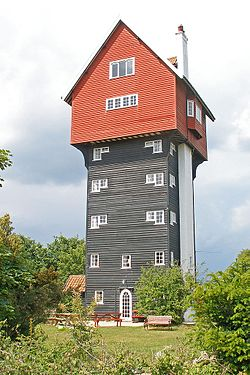
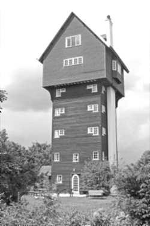
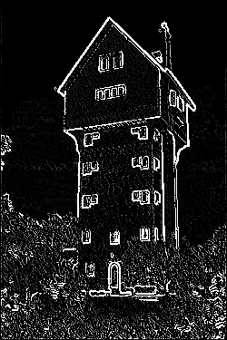
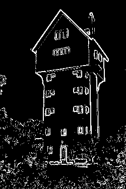
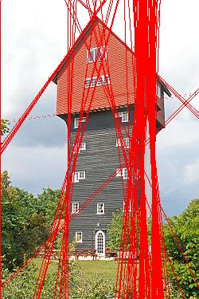

# Filters
Custom C# filters for images.
The library contains a set of different methods for image processing,
such as Resize, Rotate, Cut and Merge two images.
There are also simple filters that I used for create Hough algorithm.

Examples:

Created by algorithms from post: https://habr.com/post/114589/

Original image from https://ru.wikipedia.org/wiki/%D0%94%D0%BE%D0%BC_%D0%B2_%D0%BE%D0%B1%D0%BB%D0%B0%D0%BA%D0%B0%D1%85

	Original image

	

	Gray Filter

	

	Blur Gaussian Filter

	

	Sobel Filter

	

	Post processing

  

	Hough algorithm to find lines

	

